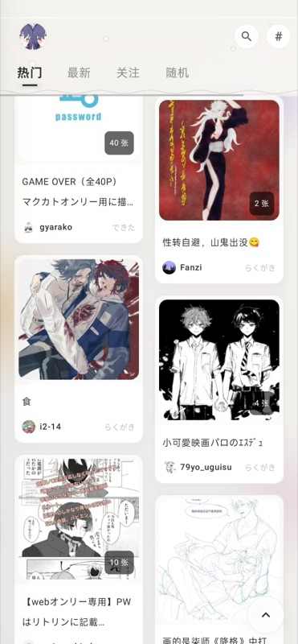
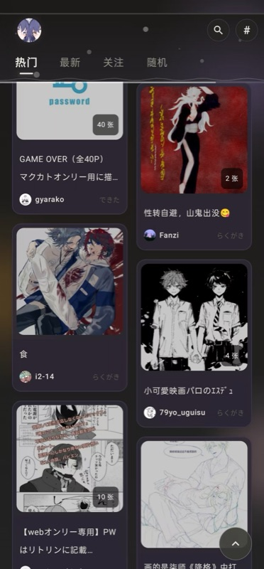
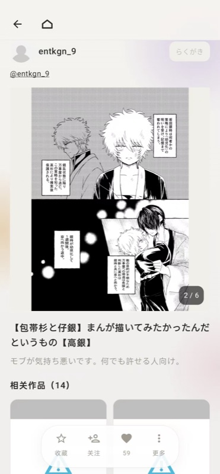
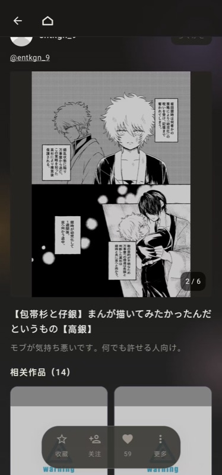

# Piku

Poipiku 第三方客户端 / Poipiku 非公式クライアント

## 截图 / スクリーンショット

| 首页（亮色）/ ホーム（ライト） | 首页（暗色）/ ホーム（ダーク） | 详情页（亮色）/ 詳細（ライト） | 详情页（暗色）/ 詳細（ダーク） |
| --- | --- | --- | --- |
|  |  |  |  |

## 反馈 / フィードバック

欢迎提交 [Issues](https://github.com/NLick47/Piku/issues) 反馈问题或建议 / [Issues](https://github.com/NLick47/Piku/issues) よりバグ報告・提案をお願いします

> 免责声明 / 免責事項：本项目仅用于学习与个人使用，与 Poipiku 官方无任何关联，请勿用于商业用途。所有内容版权归 Poipiku 及其原作者所有 / 本プロジェクトは学習・個人利用のみを目的としています。Poipiku 公式とは一切関係ありません。商用利用はご遠慮ください。すべてのコンテンツの著作権は Poipiku および原作者に帰属します